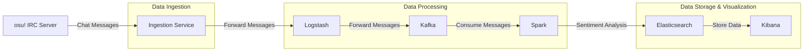

# osu-chat-sentiment-analysis


This project is designed to analyze sentiment in IRC chat messages from the osu! community via the #osu general chat. It uses a combination of Docker, Kafka, Logstash, Elasticsearch, Kibana, and Spark to process and visualize chat data.

## Project Structure

```
.env.example
.gitignore
docker-compose.yml
ingestion/
    .env
    Dockerfile
    ingestion.py
Kibana/
    dashboard.ndjson
logstash/
    config/
        logstash.conf
    Dockerfile
spark/
    Dockerfile
    sentiment_analysis.py
    worker.Dockerfile
```

## Components

### Ingestion

The ingestion service connects to the osu! IRC server, collects chat messages, and sends them to Logstash.

- **Dockerfile**: Defines the Docker image for the ingestion service.
- **ingestion.py**: The main script for connecting to the IRC server and sending messages to Logstash.
- **.env**: Contains environment variables for the IRC connection.

### Logstash

Logstash receives chat messages from the ingestion service and forwards them to Kafka.

- **Dockerfile**: Defines the Docker image for Logstash.
- **logstash.conf**: Configuration file for Logstash.

### Kafka

Kafka is used as a message broker to handle the chat messages.

### Spark

Spark processes the chat messages, performs sentiment analysis, and sends the results to Elasticsearch.

- **Dockerfile**: Defines the Docker image for the Spark master and Spark submit services.
- **worker.Dockerfile**: Defines the Docker image for the Spark worker service.
- **sentiment_analysis.py**: The main script for performing sentiment analysis on chat messages.

### Elasticsearch

Elasticsearch stores the processed chat messages and their sentiment scores.

### Kibana

Kibana is used to visualize the chat messages and their sentiment scores.

- **dashboard.ndjson**: Contains the Kibana dashboard configuration.

## Setup

1. **Clone the repository**:
    ```sh
    git clone https://github.com/yourusername/osu-chat-sentiment-analysis.git
    cd osu-chat-sentiment-analysis
    ```

2. **Copy the example environment file**:
    ```sh
    cp .env.example ingestion/.env
    ```

3. **Edit the .env file** with your osu! IRC credentials.

4. **Build and start the Docker containers**:
    ```sh
    docker-compose up --build
    ```

## Usage

- The ingestion service connects to the osu! IRC server and collects chat messages.
- Logstash receives the messages and forwards them to Kafka.
- Spark processes the messages, performs sentiment analysis, and sends the results to Elasticsearch.
- Kibana visualizes the chat messages and their sentiment scores.

## Visualizations

You can access the Kibana dashboard at `http://localhost:5601` to see the visualizations of the chat messages and their sentiment scores.


## Contributing

Contributions are welcome! Please open an issue or submit a pull request.

## License

This project is licensed under the MIT License. See the LICENSE file for details.
