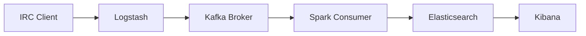

# OSU Chat Sentiment Analysis Pipeline

A real-time data pipeline that analyzes sentiment from osu! game chat messages using Apache Spark, Kafka, and the Elastic Stack.

## Architecture


## Prerequisites

- Docker and Docker Compose
- Git
- osu! IRC credentials

## Quick Start

1. Clone the repository:
```bash
git clone https://github.com/yourusername/osu-chat-sentiment-analysis.git
cd osu-chat-sentiment-analysis
```

2. Copy the environment file and configure your credentials:
```bash
cp .env.example .env
```
Edit `.env` with your osu! IRC credentials:
```env
IRC_USERNAME=your_username
IRC_PASSWORD=your_password
LOGSTASH_URL=http://logstash:5044
```

3. Start the services:
```bash
docker-compose up -d
```

## Component Details

### 1. IRC Client (Python)
- Located in `/irc_client`
- Connects to osu! chat using IRC protocol
- Forwards messages to Logstash
- Auto-reconnection handling
- Configuration via environment variables

### 2. Logstash
- Located in `/logstash`
- Listens on port 5044
- Processes incoming JSON messages
- Forwards to Kafka topic
- Configuration in `logstash.conf`

### 3. Apache Kafka
- Located in `/kafka`
- Message broker for the pipeline
- Two topics:
  - `osu-chat-topic`: Raw chat messages
  - `osu-chat-sentiment`: Processed sentiment results
- Configuration in `server.properties`

### 4. Apache Spark
- Located in `/spark`
- Performs sentiment analysis using TextBlob
- Streams data from Kafka
- Writes results to Elasticsearch
- PySpark application in `sparkConsumer.py`

### 5. Elasticsearch
- Located in `/elasticsearch`
- Stores processed chat messages with sentiment scores
- Single-node configuration for development
- Data persistence through Docker volumes

### 6. Kibana
- Located in `/kibana`
- Visualization and dashboard interface
- Access at `http://localhost:5601`

## Configuration Files

### Docker Compose
The `docker-compose.yml` defines all services and their configurations:
- Network configuration
- Volume mappings
- Environment variables
- Service dependencies
- Resource limits

### Environment Variables
Key variables in `.env`:
- `IRC_USERNAME`: Your osu! username
- `IRC_PASSWORD`: Your IRC password
- `LOGSTASH_URL`: Logstash endpoint

## Service Ports

| Service       | Port  | Purpose                    |
|--------------|-------|----------------------------|
| Logstash     | 5044  | HTTP input                 |
| Kafka        | 9092  | Message broker             |
| Zookeeper    | 2181  | Kafka coordination         |
| Elasticsearch| 9200  | REST API                   |
| Kibana       | 5601  | Web interface              |

## Data Flow

1. **Message Ingestion**
   - IRC client connects to osu! chat
   - Messages are captured and sent to Logstash

2. **Message Processing**
   - Logstash formats and forwards to Kafka
   - Spark consumes messages from Kafka
   - Sentiment analysis is performed

3. **Storage and Visualization**
   - Results stored in Elasticsearch
   - Real-time visualization in Kibana

## Development

### Directory Structure
```
osu-chat-sentiment-analysis/
├── .env.example
├── docker-compose.yml
├── elasticsearch/
│   ├── Dockerfile
│   └── config/
│       └── elasticsearch.yml
├── kafka/
│   ├── Dockerfile
│   └── config/
│       └── server.properties
├── kibana/
│   ├── Dockerfile
│   └── config/
│       └── kibana.yml
├── logstash/
│   ├── Dockerfile
│   └── logstash.conf
├── spark/
│   ├── Dockerfile
│   ├── requirements.txt
│   └── sparkConsumer.py
└── irc_client/
    ├── Dockerfile
    ├── requirements.txt
    └── ingestion.py
```

### Adding New Features
1. Create feature branch
2. Implement changes
3. Test locally with Docker Compose
4. Submit pull request

## Monitoring

### Logs
View service logs:
```bash
docker-compose logs -f [service-name]
```

### Health Checks
1. Elasticsearch: `curl http://localhost:9200/_cat/health`
2. Kafka: Check topics with `kafka-topics.sh --list --bootstrap-server localhost:9092`
3. Kibana: Access dashboard at `http://localhost:5601`

## Troubleshooting

### Common Issues

1. **IRC Connection Fails**
   - Verify credentials in `.env`
   - Check IRC client logs
   ```bash
   docker-compose logs irc-client
   ```

2. **Kafka Connection Issues**
   - Ensure Zookeeper is running
   - Check Kafka broker logs
   ```bash
   docker-compose logs kafka
   ```

3. **Spark Processing Errors**
   - Verify Spark dependencies
   - Check Spark logs
   ```bash
   docker-compose logs spark
   ```

### Resetting the Environment
```bash
docker-compose down -v  # Remove volumes
docker-compose build --no-cache  # Rebuild images
docker-compose up -d  # Start fresh
```

## Production Considerations

1. **Security**
   - Enable authentication for Elasticsearch
   - Secure Kafka with SSL
   - Use secrets management for credentials

2. **Scaling**
   - Configure Kafka partitions
   - Add Elasticsearch nodes
   - Implement proper monitoring

3. **Backup**
   - Regular Elasticsearch snapshots
   - Kafka topic replication
   - Log rotation

## Contributing

1. Fork the repository
2. Create feature branch
3. Commit changes
4. Push to branch
5. Create pull request

## License

This project is licensed under the MIT License - see the LICENSE file for details.

## Acknowledgments

- osu! game and community
- Apache Spark, Kafka, and Elasticsearch communities
- TextBlob for sentiment analysis

## Contact

For questions or support, please open an issue in the repository.